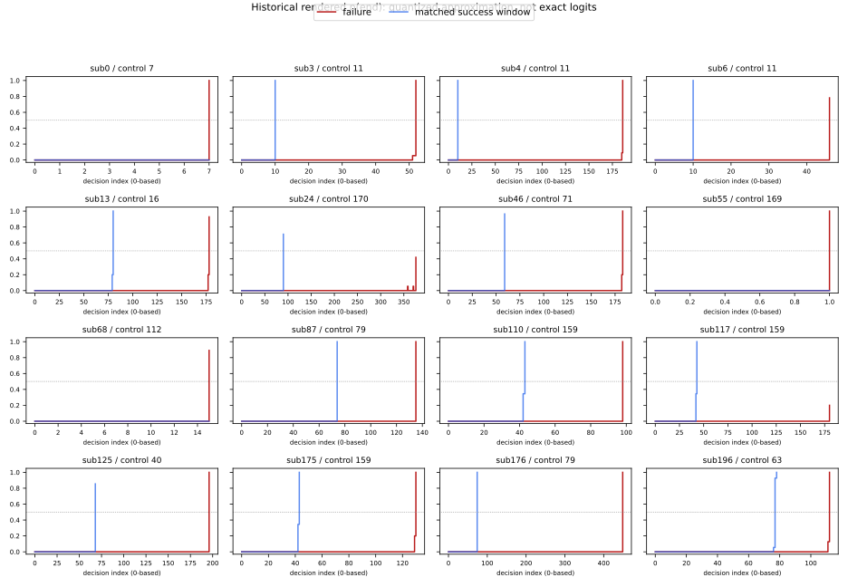

# Premature-end dynamics: historical observational audit

Status: AWAITING_PI_REVIEW. All 16/16 candidate failure traces were recovered, with exact archived video hashes and frame counts equal to episode length. Every final executed action is end; none has an earlier executed end. No stop condition was triggered. The matched-control audit recovered 16/16 pairs using 11 unique same-category success videos, with replacement and no cross-category fallback.

## Frozen morphology results

| Morphology | n/16 | Fraction |
| --- | --- | --- |
| EARLY_HIGH_PRIOR | 1/16 | 6.2% |
| LATE_RISE | 13/16 | 81.2% |
| LOW_PROB_END | 0/16 | 0.0% |
| OTHER_OR_UNCLEAR | 2/16 | 12.5% |

The fractions describe this fixed historical 16-case census; they are not estimates of a new rollout's performance or independent causal effects. No new SR or Safety Cost was measured. Reference only: the aligned historical run had 173/200 success and total Safety Cost 145.

## What the traces actually show

All 16 first-decision end bars are sub-resolution. All preterminal p(end) maxima are below 0.5; the largest recovered value is 0.200. For all 14 cases that ever cross 0.5, the first crossing occurs at the executed end decision itself. Thus LATE_RISE is the preregistered label for a low early window and a high terminal value; these data do not show a gradual buildup after prolonged unsuccessful search.

The one EARLY_HIGH_PRIOR case is sub55, a two-decision sofa failure: step0 is sub-resolution and step1 is the terminal high-probability end. Its first-five window necessarily includes termination. This is an early-window morphology, not evidence of a high task-start prior before exploration. LOW_PROB_END has 0/16 under the specified <0.1 threshold. Sub24 (~0.418 at end) and sub117 (~0.200) are OTHER_OR_UNCLEAR; stochastic execution remains possible without meeting that low-probability category.

| Sample ID | Decisions | Pre-end max | At end approx | Morphology | Scope |
| --- | --- | --- | --- | --- | --- |
| 0 | 8 | 0.000 | 1.000 | LATE_RISE | AMBIGUOUS |
| 3 | 53 | 0.055 | 1.000 | LATE_RISE | STRICT |
| 4 | 187 | 0.091 | 1.000 | LATE_RISE | STRICT |
| 6 | 47 | 0.000 | 0.782 | LATE_RISE | STRICT |
| 13 | 179 | 0.200 | 0.927 | LATE_RISE | STRICT |
| 24 | 377 | 0.055 | 0.418 | OTHER_OR_UNCLEAR | AMBIGUOUS |
| 46 | 184 | 0.200 | 1.000 | LATE_RISE | STRICT |
| 55 | 2 | 0.000 | 1.000 | EARLY_HIGH_PRIOR | STRICT |
| 68 | 16 | 0.000 | 0.891 | LATE_RISE | STRICT |
| 87 | 136 | 0.000 | 1.000 | LATE_RISE | STRICT |
| 110 | 99 | 0.000 | 1.000 | LATE_RISE | AMBIGUOUS |
| 117 | 181 | 0.000 | 0.200 | OTHER_OR_UNCLEAR | STRICT |
| 125 | 197 | 0.000 | 1.000 | LATE_RISE | STRICT |
| 175 | 131 | 0.200 | 1.000 | LATE_RISE | AMBIGUOUS |
| 176 | 450 | 0.000 | 1.000 | LATE_RISE | STRICT |
| 196 | 113 | 0.127 | 1.000 | LATE_RISE | STRICT |

## Matched-success contrast and its limits

All 16 pair-specific success early windows have max p(end)<0.5 (indeed sub-resolution in the first five available frames). However, 15/16 matched pairs (10/11 unique controls) also first cross 0.5 only at their own successful terminal decision. Abrupt terminal probability increase is therefore not specific to failed termination.

Thirteen of 16 prescribed windows include the control's successful terminal frame because those controls finish earlier. The median paired window-end probability difference is 0.000; this contrast often compares failed end to successful end, not equal-duration search states. The median expert-length gap is 34.0 decisions (range 2–133). Matching is an incomplete task-difficulty proxy; controls are reused and pairs are not 16 independent control episodes. The two-decision sub55 comparison is descriptive only, with a 42-decision expert-length gap.

## Measurement validation

Eight row/action identities were frozen from the archived rendering source and the existing sub120 method. One black-text row must be uniquely detected at three thresholds (60/70/80). End probabilities use the preserved strict-blue endpoint estimator divided by 55. A secondary chromatic endpoint method gives the same 16 morphology labels; its end endpoints differ by at most one pixel in analyzed case/control frames. All 16 labels also survive the declared +/-2/55 nonzero-value sensitivity perturbation (zero represented as [0,1/55]). These are measurement sensitivity checks, not statistical confidence intervals.

The inclusive PIL rectangle endpoint and lossy video color thresholds prevent exact probability recovery. A zero bar means below approximately 1/55, not exact zero. A displayed estimate capped at 1 means near-saturated, not proven true probability 1. Threshold-crossing indices are based on quantized approximate values. The decoder reproduced all 600 preserved sub120 executed actions and end approximations; sub120 is only a validation reference, excluded from the 16-case result.

Frame0 maps to the first policy decision; the on-video counter is 1-based. Archived worker source passes the same decision's probabilities and actual executed action into the frame and saves the terminal frame before breaking. Source excerpts and exact hashes are in source_semantics.json. Current worker source differs from that commit and is not substituted for historical evidence. This audit never imports or runs that worker.

## Target-evidence boundary

12 cases have STRICT narrow==broad target IDs; 4 (sub0, sub24, sub110, sub175) are AMBIGUOUS. The CSV preserves both ID sets. Historical narrow visibility and room visitation are descriptive aggregate fields, not per-decision stop-legality proof. For ambiguous cases, zero narrow visibility cannot establish that every success-eligible target was unseen. Stable sub_house_id is used only as an ID/tie-break, not as house identity or difficulty.

## Interpretation and one proposed next branch

The preregistered leading morphology is LATE_RISE (13/16); there is no evidence for a population-wide high initial prior or <0.1 stochastic-end morphology. The more precise observational description is an abrupt terminal Actor-end probability jump, which also occurs in matched successful episodes. The present audit does not identify why an end decision is invalid, whether a target was correctly grounded, or which training component caused it.

Proposed next causal branch, not approved: following the frozen LATE_RISE decision rule, PI may design a matched hard-task policy comparison between SafeVLA and the closest justified non-safety/base policy (ideally FLaRe if available), with protocol/checkpoint comparability explicitly reviewed. This is a discrimination test, not attribution to safety alignment. No comparison, checkpoint search/load, hidden-state Probe, replay or rollout was started. Gate B remains unresolved for later hidden-state interpretation. Current Executor stops after handoff publication.

## Evidence

- premature_end_cases.csv: complete case-level metrics and target scope.
- matched_success_controls.csv: exact matches, gaps, windows and contrasts.
- pdone_trace_summary.csv and trace_sub*.csv: all approximate probability/action traces.
- frozen_extraction_plan.json, reference_validation.json, independent_validation.json: frozen rules and checks.
- input_manifest.json and ARTIFACT_INDEX.json: original video/table/script identities; large original media remain server-side.

